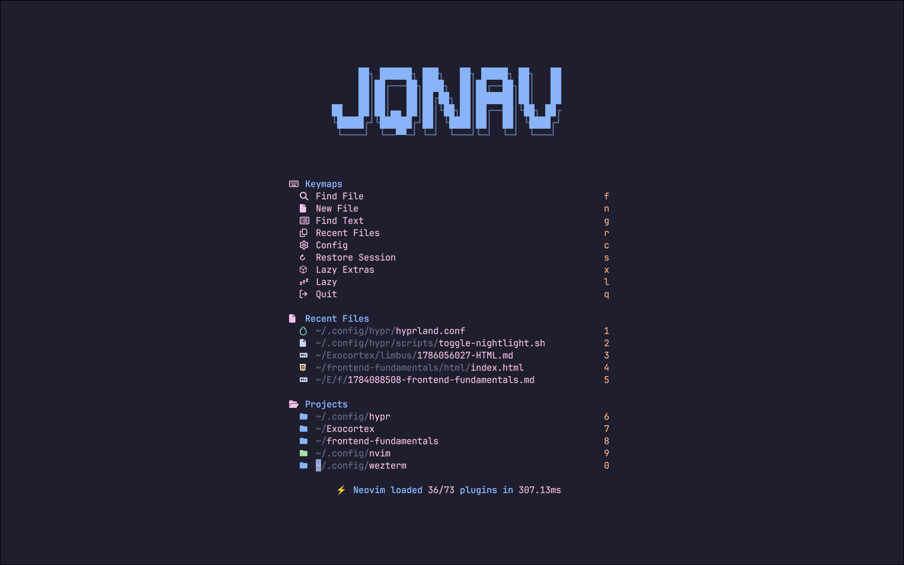

# jqnav LazyVim

A personalized Neovim configuration built on
[LazyVim](https://github.com/LazyVim/LazyVim), optimized for full-stack
development, knowledge management, and AI-assisted workflows.



## Features

### AI & Coding Assistants

- **GitHub Copilot** — inline suggestions integrated with blink.cmp completion
- **CopilotChat** — 15+ custom prompts (explain, refactor, tests, conventional
  commits, translation)
- **OpenCode AI Agent** — local AI for docstrings, git workflows, and NotebookLM
  integration

### Language Support

- **TypeScript/JavaScript** — LSP, ESLint, Prettier, Next.js snippets, Tailwind
  CSS, Prisma
- **Python** — Pyright, Ruff, Flake8, Jupyter notebook support
- **Java** — Full LSP setup
- **C#** — OmniSharp
- **Rust** — rust-analyzer
- **R & Julia** — Language servers and Treesitter grammars
- **LaTeX** — texlab + latexindent formatting
- **Markdown** — LSP, linting, rendering, and live HTML preview

### Knowledge Management

- **Obsidian integration** — Zettelkasten workflow with templates, note
  creation, and TODO-to-note conversion
- **Mermaid diagrams** — inline rendering via Sixel (Wezterm)
- **PDF viewer** — read PDFs directly in Neovim
- **Auto TODO→DONE** — markdown buffers auto-complete TODO items on save

### UI & Productivity

- **Catppuccin Mocha** theme with transparent background toggle
- **Snacks.nvim** — dashboard, picker, terminal, zen/zoom modes
- **Oil.nvim** — fast file explorer
- **Telescope** — fuzzy finding with live-grep-args and file browser
- **Which-key** — contextual keymap hints
- **Multi-cursor** editing via vim-visual-multi
- **OSC52** — system clipboard from terminal

## Requirements

| Tool                                                     | Purpose                         |
| -------------------------------------------------------- | ------------------------------- |
| [Neovim](https://github.com/neovim/neovim) >= 0.10       | Editor                          |
| [git](https://git-scm.com/)                              | Version control                 |
| [lazygit](https://github.com/jesseduffield/lazygit)      | Terminal Git UI                 |
| [fzf](https://github.com/junegunn/fzf)                   | Fuzzy finder                    |
| [fd](https://github.com/sharkdp/fd)                      | File finder                     |
| [ripgrep](https://github.com/BurntSushi/ripgrep)         | Fast grep                       |
| [bat](https://github.com/sharkdp/bat)                    | Syntax-highlighted cat          |
| [gcc](https://gcc.gnu.org/)                              | Compiler (for building plugins) |
| [curl](https://curl.se/)                                 | HTTP client                     |
| [nodejs](https://nodejs.org/)                            | Runtime (copilot, LSP servers)  |
| [mermaid-cli](https://github.com/mermaid-js/mermaid-cli) | Diagram rendering               |
| [gh](https://cli.github.com/)                            | GitHub CLI (issue creation)     |
| [opencode](https://github.com/opencode-ai/opencode)      | AI agent                        |
| [pylatexenc](https://github.com/phfaist/pylatexenc)      | LaTeX support                   |

## Installation

### 1. Back up your current configuration

```bash
cp -r ~/.config/nvim/ ~/.config/nvim.bak/
```

### 2. Clone this repository

```bash
git clone https://github.com/juanQNav/jqnav-lazy-vim.git ~/.config/nvim
```

### 3. Launch Neovim

```bash
nvim
```

LazyVim and all plugins will install automatically on first launch.

## Key Mappings

### AI & Copilot

| Key           | Action                                          |
| ------------- | ----------------------------------------------- |
| `<leader>ct`  | Toggle Copilot suggestions                      |
| `<leader>aca` | Toggle Copilot Chat                             |
| `<leader>acq` | Quick chat with Copilot                         |
| `<leader>acp` | Select from custom Copilot prompts              |
| `<leader>ao*` | OpenCode AI agent (docstrings, git, NotebookLM) |

### Search & Navigation

| Key          | Action                      |
| ------------ | --------------------------- |
| `<leader>fr` | Find files (root directory) |
| `<leader>fg` | Live grep with arguments    |
| `-`          | Open Oil file explorer      |

### Obsidian & Notes

| Key          | Action                |
| ------------ | --------------------- |
| `<leader>oo` | Switch Obsidian vault |
| `<leader>os` | Search notes          |
| `<leader>on` | Create new note       |
| `<leader>od` | Toggle TODO checkbox  |

### Utilities

| Key                  | Action                           |
| -------------------- | -------------------------------- |
| `<leader>ut`         | Toggle transparent background    |
| `<leader>uz`         | Zoom mode                        |
| `<leader>us`         | Toggle spell check (EN/ES)       |
| `<leader>y` (visual) | Copy to system clipboard (OSC52) |
| `<leader>gn`         | Create GitHub Issue              |
| `<leader>cp`         | HTML live preview                |
| `<C-q>`              | Exit terminal/insert mode        |

> Run `<leader>sk` to see all keymaps via which-key.

## Spell Check

Bilingual spell checking is enabled for **English** and **Spanish**. Custom
words are stored in `spell/`.

| Key          | Action                   |
| ------------ | ------------------------ |
| `<leader>ic` | Suggest correction       |
| `<leader>in` | Next misspelled word     |
| `<leader>ip` | Previous misspelled word |
| `<leader>ia` | Add word to dictionary   |

## Customization

- **Plugins**: Add or modify plugins in `lua/plugins/`
- **Keymaps**: Edit `lua/config/keymaps.lua`
- **Options**: Edit `lua/config/options.lua`
- **LazyVim extras**: Configure in `lazyvim.json`

## License

MIT
